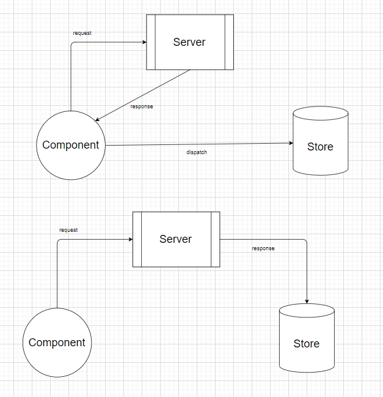

# PROJECT MOVIE

## Bố cục, phân tích chia folder

1. Main
   -Giúp khách hàng thao tác trên trang web, xem danh sách phim, giỏ hàng,...

   1. Page: dùng để phân chia các trang
   2. Component: chứa các component có thể reuse trong page
      1. Header
   3. Redux: chua rootReducer and childReducer
   4. Store: chua action, store, action type constant

2. Admin
   -Thêm xóa sửa phim, thao tác với user.

3. APIs
   -Gíup tách axios ra file riêng, để dễ quản lý

## yarn create react-app app-name

## cd app-name

## yarn Start

## Install Bootstrap

```
yarn add bootstrap@4.0.0
```

Down grade version of bootstrap

```
yarn add jquery bootstrap popper.js
```

## yarn add node-sass@4.14.1

Phien ban on dinh cua yarn

## Note

Cau truc thu muc
10h17

## Tại sao các website lớn như VNExpress có load trang

=> Những MPA website khi load phải tạo html từ sever-side-render thì phải load trang => Nhưng hỗ trợ về SEO tốt hơn

=> Những SPA website không load trang thì html được tạo từ client-side-render => nhưng hỗ trợ SEO không mạnh

=> Để giải quyết vấn đề này thì phải sử dụng FrameWork Next.JS

> Lý do bên trong là ta sử dụng thẻ meta để hỗ trợ SEo, nhưng vì SPA chỉ có một page HTML nên chỉ có một thẻ meta. Còn client-side-rendering thì mỗi lần load tạo ra một thẻ HTML nên SEO được nhiều thẻ meta

## Call APIs

tại component did mount do bất đồng bộ

https://movie0706.cybersoft.edu.vn/api/QuanLyPhim/LayDanhSachPhim?maNhom=GP01

## 14/7 - Buoi 1 - movie Project

1. Chia cau truc thu muc

2. React Router, React Router DOM

## 16/7 - Buoi 2 - movie Project

1. create store, reducer

2. create actions folder, constants type

3. In `home page` link component with store

4. dispatch action (contain data movie) to store by function `getMovieList` in `hone page`

tips: sau khi truyền mapStateToProps vào component của react dev tool kiểm tra đã có props chưa

tips2: để biết cần lấy state nào từ reducer -> ra phần `state` của redux dev tool coi

5. in `home page` render list of movieList to JSX by function

6. Do call APIs trong component `home page` quá bất tiện nên ta dùng `Redux middleware`

### Redux middleware

Sinh ra để tối ưu performance cho code

Để không cần `dispatch` data sau khi call `APIs`, ta cần dùng `middleware` redux-thunk, redux-saga => call `APIs` ngay trong action

 

---

Ta `call APIs` trong `action` không cần thông qua component

Nói ngắn gọn `middleware` giúp chúng ta xử lý bất đồng bộ trong `action`, **_dispatch an action in action_**

7. Thêm một file để gọi axios riêng biệt để dễ chỉnh sửa, debug

8. Chia card.movie.component ra riêng để dễ quản lý

## 19/7 - Buoi 2 - movie Project

1. call aip ở component didmount ở page movie detail

   - Xác định chổ cần call API
   - Viết hàm call api.
   - Viết action creator thunk để call api để tránh một bước call api thông qua component, chỉ call api qua action creator xong truyền thẳng vào store luôn

2. sign in

   - call api khi submit form
   - khi submit form thì dispatch action => action đó call api ra gởi lên stỏe
   - ở page sign in lấy dữ liệu từ trên store về
